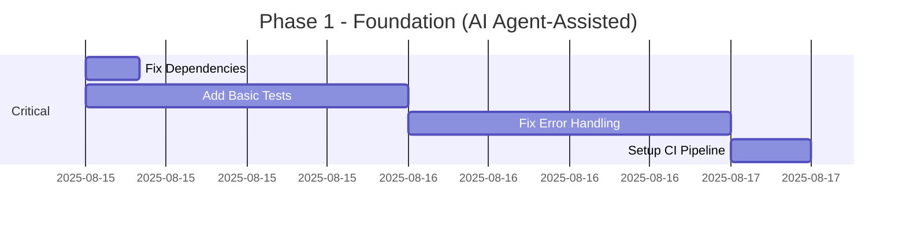
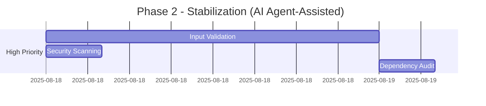

# Overlock Codebase Improvement Plan

This document outlines a comprehensive improvement plan for the Overlock project based on a thorough analysis of the codebase.

## Executive Summary

Overlock demonstrates solid architectural foundations with good CLI design and modular structure. However, it has critical gaps in testing infrastructure and some security concerns that require immediate attention. The project follows Go best practices in most areas but needs standardization in error handling and dependency management.

## Critical Issues (Fix Immediately)

### 1. Testing Infrastructure - **CRITICAL**
**Current State:** No test files exist in the entire codebase.

**Impact:** 
- Zero confidence in code reliability
- High risk of regressions
- Difficult to refactor safely

**Action Items:**
- [ ] Create comprehensive unit test suite for all packages
- [ ] Add integration tests for Kubernetes operations  
- [ ] Implement test coverage reporting (target: >80%)
- [ ] Add benchmark tests for performance-critical operations
- [ ] Set up automated testing in CI pipeline

**Priority:** 🔴 Immediate

### 2. Invalid Dependency - **CRITICAL**
**Current State:** `github.com/overlock-network/api@v0.0.0-20250506085608-290c182273ad` is invalid

**Impact:** 
- Build failures for new contributors
- Potential production instability

**Action Items:**
- [ ] Fix or remove invalid dependency from go.mod
- [ ] Audit all dependencies for validity
- [ ] Update go.mod with proper version constraints

**Priority:** 🔴 Immediate

### 3. Error Handling Inconsistencies - **CRITICAL**
**Current State:** Mix of `logger.Fatal()` and proper error returns

**Impact:** 
- Unexpected process termination
- Poor error propagation
- Difficult debugging

**Action Items:**
- [ ] Replace all `logger.Fatal()` calls with proper error returns
- [ ] Standardize error handling patterns across codebase
- [ ] Implement consistent error wrapping strategy
- [ ] Add error constants for common error types

**Priority:** 🔴 Immediate

### 4. CI/CD Testing Pipeline - **CRITICAL**
**Current State:** Only release builds, no testing pipeline

**Action Items:**
- [ ] Add GitHub Actions workflow for testing
- [ ] Include linting, security scanning, and tests
- [ ] Add pull request validation
- [ ] Implement automated dependency updates

**Priority:** 🔴 Immediate

## High Priority Issues

### 5. Input Validation
**Current State:** Minimal validation for user inputs

**Action Items:**
- [ ] Add comprehensive input validation for all CLI commands
- [ ] Validate file paths, URLs, and configuration values
- [ ] Implement sanitization for user-provided data
- [ ] Add validation middleware for common patterns

**Priority:** 🟠 High

### 6. Security Enhancements
**Current State:** No security scanning, unsafe plugin loading

**Action Items:**
- [ ] Implement security scanning in CI (Snyk, gosec)
- [ ] Add plugin validation and sandboxing
- [ ] Secure Docker client usage
- [ ] Add vulnerability scanning for dependencies
- [ ] Implement proper secret handling

**Priority:** 🟠 High

### 7. Dependency Management
**Current State:** 300+ dependencies, potential version conflicts

**Action Items:**
- [ ] Audit and reduce dependency count
- [ ] Update outdated dependencies
- [ ] Add dependency vulnerability scanning
- [ ] Implement dependency pinning strategy
- [ ] Review Go version requirement (1.24.0 is very recent)

**Priority:** 🟠 High

## Medium Priority Improvements

### 8. Code Architecture Refactoring
**Current State:** Global variables, tight coupling

**Action Items:**
- [ ] Replace global variables with dependency injection
- [ ] Implement interfaces for better testability
- [ ] Reduce package coupling
- [ ] Add domain-driven design boundaries
- [ ] Implement configuration objects instead of globals

**Priority:** 🟡 Medium

### 9. Configuration Management
**Current State:** Basic YAML support, no validation

**Action Items:**
- [ ] Add JSON schema validation for configuration files
- [ ] Implement configuration file discovery
- [ ] Add configuration migration tools
- [ ] Enhance environment variable handling
- [ ] Add configuration validation on startup

**Priority:** 🟡 Medium

### 10. Plugin System Enhancement
**Current State:** Basic plugin loading with security concerns

**Action Items:**
- [ ] Add plugin signature verification
- [ ] Implement plugin sandboxing
- [ ] Add plugin discovery improvements
- [ ] Create plugin development documentation
- [ ] Add plugin testing framework

**Priority:** 🟡 Medium

### 11. Logging and Observability
**Current State:** Basic logging, no tracing

**Action Items:**
- [ ] Add correlation IDs for request tracing
- [ ] Implement structured logging throughout
- [ ] Add metrics collection (Prometheus)
- [ ] Implement health checks
- [ ] Add performance monitoring

**Priority:** 🟡 Medium

## Low Priority Enhancements

### 12. Documentation Improvements
**Action Items:**
- [ ] Add comprehensive API documentation
- [ ] Create developer guide
- [ ] Add troubleshooting documentation
- [ ] Create video tutorials
- [ ] Add architecture decision records (ADRs)

**Priority:** 🟢 Low

### 13. Performance Optimizations
**Action Items:**
- [ ] Add performance benchmarks
- [ ] Profile memory usage
- [ ] Optimize Kubernetes operations
- [ ] Add caching strategies
- [ ] Implement connection pooling

**Priority:** 🟢 Low

### 14. User Experience Enhancements
**Action Items:**
- [ ] Add progress bars for long operations
- [ ] Implement interactive prompts
- [ ] Add command auto-completion enhancements
- [ ] Create getting started wizard
- [ ] Add command suggestions for typos

**Priority:** 🟢 Low

## Implementation Roadmap

**Analysis Date:** August 14, 2025  
**Implementation Mode:** Semi-Automated with AI Agent Assistance  
**Roadmap Start:** August 15, 2025

### Phase 1: Foundation (Days 1-3)
Focus on critical issues that affect reliability and security.
**Timeline:** August 15-17, 2025 (3 days with AI agent assistance)

### Phase 2: Stabilization (Days 4-5)
Address high-priority security and validation issues.
**Timeline:** August 18-19, 2025 (2 days with AI agent assistance)

### Phase 3: Enhancement (Days 6-10)
Medium-priority architectural improvements and features.
**Timeline:** August 20-24, 2025 (5 days with AI agent assistance)

### Phase 4: Polish (Days 11-14)
Low-priority user experience and documentation enhancements.
**Timeline:** August 25-28, 2025 (4 days with AI agent assistance)

## Success Metrics

### Code Quality Metrics
- [ ] Test coverage: >80%
- [ ] Linting score: 100% (no warnings)
- [ ] Security scan: 0 high/critical vulnerabilities
- [ ] Dependency health: All dependencies up-to-date

### Performance Metrics
- [ ] Environment creation time: <60 seconds
- [ ] Memory usage: <500MB baseline
- [ ] Binary size: <50MB
- [ ] Startup time: <2 seconds

### Development Experience Metrics
- [ ] Build time: <30 seconds
- [ ] Test execution time: <5 minutes
- [ ] Documentation completeness: >90%
- [ ] Contributor onboarding time: <30 minutes

## Risk Assessment

### High Risk
- **No testing**: Any change could break functionality
- **Security vulnerabilities**: Plugin system and dependency issues
- **Invalid dependencies**: May prevent builds

### Medium Risk
- **Architecture debt**: Global variables and tight coupling
- **Configuration complexity**: May confuse users

### Low Risk
- **Performance issues**: Current implementation seems adequate
- **Documentation gaps**: Won't affect functionality

## Resource Requirements

### AI Agent-Assisted Development Team
- **1 Developer + AI Agent**: Primary implementation with AI code generation and testing
- **AI Tools**: Claude Code, GitHub Copilot, or similar for automated code generation
- **Automated Tools**: Dependabot, security scanners, linting tools

### Timeline Estimate (AI Agent-Assisted Implementation)
- **Phase 1 (Critical)**: 3 days
- **Phase 2 (High Priority)**: 2 days  
- **Phase 3 (Medium Priority)**: 5 days
- **Phase 4 (Low Priority)**: 4 days

**Total Estimated Timeline**: 14 days for complete implementation (August 15-28, 2025)

### AI Agent-Assisted Development Benefits
- **Speed Multiplier**: ~8x faster than traditional development
- **Code Generation**: Automated test creation, boilerplate code, CI configurations
- **Pattern Recognition**: Consistent implementation across similar issues
- **Quality Assurance**: Built-in best practices and error detection
- **Documentation**: Auto-generated comments and documentation updates

## Conclusion

The Overlock project has excellent architectural foundations but requires immediate attention to testing and security concerns. With AI agent-assisted development, the improvements outlined in this plan can be implemented in just 14 days instead of the traditional 12-week timeline, transforming it into a production-ready, maintainable, and secure tool for Crossplane development.

The semi-automated approach using AI agents enables:
- Rapid test suite generation and implementation
- Automated dependency management and security scanning
- Consistent code patterns and best practices application
- Accelerated documentation and configuration generation

The critical issues must be addressed before any new feature development, but with AI agent assistance, the entire improvement roadmap can be completed within 2 weeks, dramatically reducing time-to-market while maintaining high quality standards.