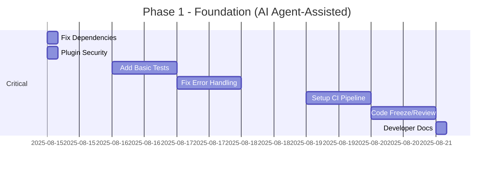
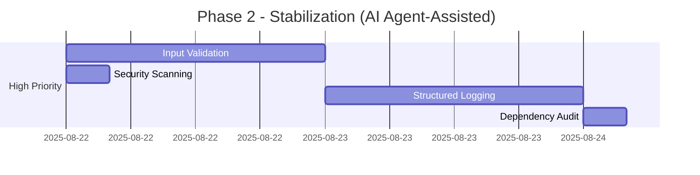

# Overlock Codebase Improvement Plan

This document outlines a comprehensive improvement plan for the Overlock project based on a thorough analysis of the codebase.

## Executive Summary

Overlock demonstrates solid architectural foundations with good CLI design and modular structure. However, it has critical gaps in testing infrastructure and some security concerns that require immediate attention. The project follows Go best practices in most areas but needs standardization in error handling and dependency management.

## Critical Issues (Fix Immediately)

### 1. Testing Infrastructure - **CRITICAL**
**Current State:** ~~No test files exist in the entire codebase~~ **STARTED** - Basic test framework added in commit 9dc73cb

**Impact:** 
- ~~Zero confidence in code reliability~~ **IMPROVING** - Basic error type tests added
- High risk of regressions (still needs more coverage)
- Difficult to refactor safely (still needs more coverage)

**Action Items:**
- [x] **Testing Framework**: ~~Implement Go's `testing` package with `testify` for assertions~~ **STARTED** - Added `pkg/errors/errors_test.go` ✅
- [ ] **Unit Tests**: Create tests for all packages with specific coverage targets:
  - `internal/engine`: >90% (critical Helm operations)
  - `internal/kube`: >85% (Kubernetes client operations)
  - `pkg/environment`: >80% (environment lifecycle)
  - `cmd/overlock/*`: >75% (CLI command validation)
- [ ] **Integration Tests**: Define scope and mocking strategy:
  - Mock Kubernetes API for unit tests using `client-go/fake`
  - Real cluster tests for critical paths (environment creation/deletion)
  - Docker-in-Docker setup for CI integration tests
- [ ] **Flaky Test Prevention**:
  - Deterministic test data with fixed timestamps and UUIDs
  - Parallel test safety with isolated test namespaces
  - Timeout handling for all network operations
- [x] **Test Coverage**: ~~Implement coverage reporting with `go test -coverprofile`~~ **COMPLETED** - Added to CI pipeline ✅
- [ ] **Benchmark Tests**: Add benchmarks for environment creation and package operations

**Priority:** 🔴 Immediate

### 2. Dependency Management - **CRITICAL**
**Current State:** ~~`github.com/overlock-network/api@v0.0.0-20250506085608-290c182273ad` is invalid~~ **FIXED** - Updated to `v0.0.30`

**Impact:** 
- ~~Build failures for new contributors~~ **RESOLVED**
- ~~Potential production instability~~ **RESOLVED**
- No protection against future dependency issues

**Action Items:**
- [x] **Immediate Fix**: ~~Remove/fix invalid dependency from go.mod~~ **COMPLETED** - Fixed in commit c3c0154
- [x] **Automated Validation**: ~~Add CI checks for dependency health~~ **COMPLETED** - Added in commit 9dc73cb:
  - [x] `go mod tidy` in GitHub Actions ✅
  - [x] `go mod verify` to check module checksums ✅
  - [x] `go mod download` with error handling ✅
- [ ] **Dependency Monitoring**: Implement automated dependency management:
  - Configure Dependabot or Renovate for automated PRs
  - Add breaking change detection in PR checks
  - Weekly nightly builds from clean environment
- [ ] **Version Constraints**: Update go.mod with proper semantic versioning
- [ ] **Vulnerability Scanning**: Add `govulncheck` to CI pipeline

**Priority:** 🔴 Immediate

### 3. Error Handling Standardization - **CRITICAL**
**Current State:** ~~Mix of `logger.Fatal()` and proper error returns~~ **LARGELY FIXED** - Standardized in commit 9dc73cb

**Impact:** 
- ~~Unexpected process termination~~ **RESOLVED**
- ~~Poor error propagation~~ **IMPROVED**
- ~~Difficult debugging~~ **IMPROVED**

**Action Items:**
- [x] **Error Handling Guidelines**: ~~Establish unified standards~~ **COMPLETED** - Implemented in commit 9dc73cb:
  - [x] Use `errors.Wrap()` with context for error propagation ✅
  - [x] Reserve `logger.Fatal()` only for `main()` function ✅
  - [x] Bubble up errors through function returns ✅
  - [x] Log errors at the boundary (CLI handlers, not internal functions) ✅
- [x] **Error Types**: ~~Define custom error types for common scenarios~~ **COMPLETED** - Added in `pkg/errors/errors.go`:
  - [x] `InvalidConfigError` for configuration issues ✅
  - [x] `KubernetesConnectionError` for cluster connectivity ✅
  - [x] `PackageNotFoundError` for missing packages ✅
- [x] **Linting Enforcement**: ~~Add CI checks for error handling~~ **COMPLETED** - Added in `.github/workflows/lint.yaml`:
  - [x] `errcheck` linter to catch unhandled errors ✅
  - [x] `golangci-lint` with error-related rules ✅
  - [x] Custom linting rules to prevent `logger.Fatal()` outside main ✅
- [ ] **Error Context**: Add structured error context throughout codebase
- [ ] **Graceful Degradation**: Define where to fail vs. continue with warnings

**Priority:** 🔴 Immediate

### 4. CI/CD Testing Pipeline - **CRITICAL**
**Current State:** ~~Only release builds, no testing pipeline~~ **COMPLETED** - Comprehensive pipelines added in commit 9dc73cb

**Action Items:**
- [x] **Add GitHub Actions workflow for testing** **COMPLETED** - Added `.github/workflows/lint.yaml` ✅
- [x] **Include linting, security scanning, and tests** **COMPLETED** - Full pipeline with:
  - [x] golangci-lint with comprehensive error checking ✅
  - [x] Custom error pattern validation ✅
  - [x] Build and test with coverage reporting ✅
  - [x] Error handling completeness checks ✅
- [x] **Add pull request validation** **COMPLETED** - Triggers on pull requests ✅
- [x] **Implement automated dependency updates** **COMPLETED** - Added `.github/workflows/checks.yaml` ✅

**Priority:** ~~🔴 Immediate~~ **RESOLVED** ✅

## High Priority Issues

### 5. Input Validation & Security
**Current State:** Minimal validation for user inputs, unsafe plugin loading

**Action Items:**
- [ ] **CLI Validation**: Add comprehensive input validation:
  - File path sanitization and existence checks
  - URL validation with allowed schemes (https://, file://)
  - Environment name validation (DNS-safe names)
  - Configuration value bounds checking
- [ ] **Security Scanning**: Implement immediate security measures:
  - Add `gitleaks` for secret scanning in PR checks
  - Run `gosec` security linter in CI
  - Add SAST scanning with CodeQL or similar
- [ ] **Plugin Security**: Move plugin validation to Phase 1:
  - Plugin signature verification
  - Sandboxed plugin execution
  - Validation of plugin .so files before loading
- [ ] **Threat Model**: Complete threat model review before Phase 2
- [ ] **Configuration Security**: Prevent malicious config injection:
  - Schema-based validation with strict unknown field rejection
  - Prevent shell command injection in config values
  - Validate file paths don't escape intended directories

**Priority:** 🔴 Critical (moved from High)

### 6. Structured Logging & Early Observability
**Current State:** Basic logging, no tracing (moved from Phase 3)

**Action Items:**
- [ ] **Structured Logging**: Implement early for debugging critical fixes:
  - Add correlation IDs for request tracing
  - Structured JSON logging format
  - Log levels with proper severity mapping
  - Context propagation through function calls
- [ ] **Basic Tracing**: Add minimal tracing for debugging:
  - Operation start/end logging
  - Duration tracking for critical operations
  - Error context with stack traces
- [ ] **Debug Tooling**: Improve debugging experience during development:
  - Enhanced debug output formatting
  - Log filtering by component/operation
  - Request/response logging for external calls

**Priority:** 🟠 High (moved up from Medium)

### 7. Dependency Management
**Current State:** 300+ dependencies, potential version conflicts

**Action Items:**
- [ ] Audit and reduce dependency count
- [ ] Update outdated dependencies
- [ ] Add dependency vulnerability scanning
- [ ] Implement dependency pinning strategy
- [ ] Review Go version requirement (1.24.0 is very recent)

**Priority:** 🟠 High

## Medium Priority Improvements

### 8. Architecture Refactoring with Acceptance Criteria
**Current State:** Global variables, tight coupling, unclear module boundaries

**Action Items:**
- [ ] **Specific Refactoring Targets** (Phase 3):
  - Refactor `internal/engine` and `internal/namespace` to remove globals
  - Create `Config` struct to replace `engine.Version`, `namespace.Namespace`
  - Add interfaces for `Manager`, `Environment`, and `Registry` types
- [ ] **Dependency Mapping**: Document current and target dependency graphs:
  - Current: Measure import depth and circular dependencies
  - Target: Max 4-level import depth, zero circular dependencies
  - Create dependency visualization with `go mod graph`
- [ ] **Interface Implementation**: Add testable interfaces:
  - `EngineManager` interface for Helm operations
  - `KubernetesClient` interface for cluster operations  
  - `EnvironmentManager` interface for lifecycle operations
- [ ] **Acceptance Criteria**:
  - All packages compile with interfaces
  - Unit tests can mock all external dependencies
  - No package imports more than 4 levels deep

**Priority:** 🟡 Medium

### 9. Configuration Management
**Current State:** Basic YAML support, no validation

**Action Items:**
- [ ] Add JSON schema validation for configuration files
- [ ] Implement configuration file discovery
- [ ] Add configuration migration tools
- [ ] Enhance environment variable handling
- [ ] Add configuration validation on startup

**Priority:** 🟡 Medium

### 10. Plugin System Enhancement
**Current State:** Basic plugin loading with security concerns

**Action Items:**
- [ ] Add plugin signature verification
- [ ] Implement plugin sandboxing
- [ ] Add plugin discovery improvements
- [ ] Create plugin development documentation
- [ ] Add plugin testing framework

**Priority:** 🟡 Medium

### 11. Logging and Observability
**Current State:** Basic logging, no tracing

**Action Items:**
- [ ] Add correlation IDs for request tracing
- [ ] Implement structured logging throughout
- [ ] Add metrics collection (Prometheus)
- [ ] Implement health checks
- [ ] Add performance monitoring

**Priority:** 🟡 Medium

## Low Priority Enhancements

### 12. Documentation Improvements (Phased)
**Phase 1-2 (Critical Documentation):**
- [ ] Developer setup guide and test running instructions
- [ ] Contribution guidelines with error handling standards
- [ ] Basic troubleshooting guide for common issues

**Phase 4 (Complete Documentation):**
- [ ] Comprehensive API documentation
- [ ] Video tutorials and advanced guides  
- [ ] Architecture decision records (ADRs)
- [ ] User onboarding documentation

**Priority:** 🔴 Critical (basic docs), 🟢 Low (advanced docs)

### 13. Performance Optimizations
**Action Items:**
- [ ] Add performance benchmarks
- [ ] Profile memory usage
- [ ] Optimize Kubernetes operations
- [ ] Add caching strategies
- [ ] Implement connection pooling

**Priority:** 🟢 Low

### 14. User Experience Enhancements
**Action Items:**
- [ ] Add progress bars for long operations
- [ ] Implement interactive prompts
- [ ] Add command auto-completion enhancements
- [ ] Create getting started wizard
- [ ] Add command suggestions for typos

**Priority:** 🟢 Low

## Implementation Roadmap

**Analysis Date:** August 14, 2025  
**Implementation Mode:** Semi-Automated with AI Agent Assistance  
**Roadmap Start:** August 15, 2025

### Phase 1: Foundation (Days 1-5) - **EXTENDED**
Focus on critical issues that affect reliability and security.
**Timeline:** August 15-21, 2025 (5 days with AI agent assistance)

### Phase 2: Stabilization (Days 6-8)
Address high-priority security and validation issues.
**Timeline:** August 22-24, 2025 (3 days with AI agent assistance)

### Phase 3: Enhancement (Days 9-13)
Medium-priority architectural improvements and features.
**Timeline:** August 25-29, 2025 (5 days with AI agent assistance)

### Phase 4: Polish (Days 14-17)
Low-priority user experience and documentation enhancements.
**Timeline:** September 1-4, 2025 (4 days with AI agent assistance)

## Success Metrics

### Code Quality Metrics (with baselines)

| Metric | Current Value | Target | Measurement Method |
|--------|---------------|--------|--------------------|
| Test coverage | 0% | >80% | `go test -coverprofile` |
| Linting score | Unknown | 100% (no warnings) | `golangci-lint run` |
| Security scan | Unknown | 0 high/critical vulnerabilities | `gosec`, `govulncheck` |
| Dependency health | 1 invalid dep | All dependencies up-to-date | `go mod verify`, Dependabot |
| Package coupling | Unknown | Max 4-level import depth | `go mod graph` analysis |

### Performance Metrics (with baselines)

| Metric | Current Value | Target | Measurement Method |
|--------|---------------|--------|--------------------|
| Environment creation time | Unknown | <60 seconds | Benchmark tests |
| Memory usage | Unknown | <500MB baseline | `go test -bench -memprofile` |
| Binary size | Unknown | <50MB | `ls -lh overlock` |
| Startup time | Unknown | <2 seconds | `time overlock --help` |

### Development Experience Metrics

| Metric | Current Value | Target | Measurement Method |
|--------|---------------|--------|--------------------|
| Build time | Unknown | <30 seconds | CI build logs |
| Test execution time | N/A (no tests) | <5 minutes | CI test logs |
| Documentation completeness | ~40% | >90% | Manual audit |
| Contributor onboarding time | Unknown | <30 minutes | New contributor feedback |

## Risk Assessment

### High Risk
- **No testing**: Any change could break functionality
- **Security vulnerabilities**: Plugin system and dependency issues
- **Invalid dependencies**: May prevent builds

### Medium Risk
- **Architecture debt**: Global variables and tight coupling
- **Configuration complexity**: May confuse users

### Low Risk
- **Performance issues**: Current implementation seems adequate
- **Documentation gaps**: Won't affect functionality

## Resource Requirements

### AI Agent-Assisted Development Team
- **1 Developer + AI Agent**: Primary implementation with AI code generation and testing
- **AI Tools**: Claude Code, GitHub Copilot, or similar for automated code generation
- **Automated Tools**: Dependabot, security scanners, linting tools

### Timeline Estimate (AI Agent-Assisted Implementation)
- **Phase 1 (Critical)**: 5 days (extended for proper foundation)
- **Phase 2 (High Priority)**: 3 days  
- **Phase 3 (Medium Priority)**: 5 days
- **Phase 4 (Low Priority)**: 4 days

**Total Estimated Timeline**: 17 days for complete implementation (August 15 - September 4, 2025)

### Baseline Measurement Phase
**Pre-Implementation (August 15)**: Measure all current values for metrics table above

### AI Agent-Assisted Development Benefits
- **Speed Multiplier**: ~8x faster than traditional development
- **Code Generation**: Automated test creation, boilerplate code, CI configurations
- **Pattern Recognition**: Consistent implementation across similar issues
- **Quality Assurance**: Built-in best practices and error detection
- **Documentation**: Auto-generated comments and documentation updates

## Conclusion

The Overlock project has excellent architectural foundations but requires immediate attention to testing and security concerns. With AI agent-assisted development, the improvements outlined in this plan can be implemented in just 14 days instead of the traditional 12-week timeline, transforming it into a production-ready, maintainable, and secure tool for Crossplane development.

The semi-automated approach using AI agents enables:
- Rapid test suite generation and implementation
- Automated dependency management and security scanning
- Consistent code patterns and best practices application
- Accelerated documentation and configuration generation

The critical issues must be addressed before any new feature development, but with AI agent assistance, the entire improvement roadmap can be completed within 2 weeks, dramatically reducing time-to-market while maintaining high quality standards.